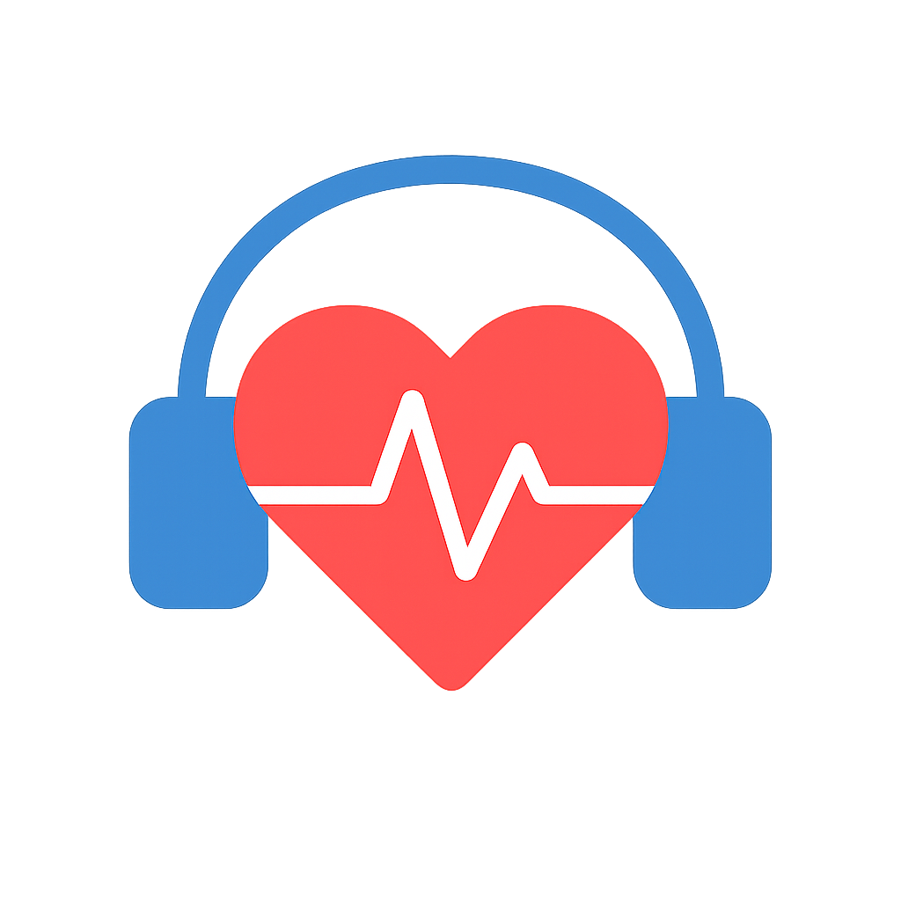

  

# **Mood DJ — User Guide**

A facial recognition-powered music curator working through the Spotify API.

## **Features**
- 📸 Collapsible camera feed and system status menu
- 🎭 Self-tuning buttons to adapt to personalized facial expressions
- 🕰️ stomizable playlist size, tick interval, and songs-per-tick values
- 🛠️ Manual options to tweak the playlist
- 📊 Live mood breakdown feed

## **Setup**
1. Visit **mood-dj.vercel.app**.
2. Click **Link Spotify**.
3. Log in with Google (add account)  
   **Email:** mooddjtesting@gmail.com  
   **Password:** mooddjdemo  
   (This is just a demo, view the Notes section if you're interested in personal use!)
4. Click **Start Camera** (allow camera permissions).
5. To personally calibrate, make a facial expression, then click the corresponding **Set Happy / Set Neutral / Set Sad** button.
6. Click **Open MoodDJ on Spotify** or open the Spotify app to inspect the playlist.
7. Tweak **Size** (playlist length), **Every** (interval in seconds between additions), and **Add per tick** (number of songs added each interval).
8. Click **Fill / Replace Playlist** to fully recreate the playlist with new songs.
9. Show or hide the **Preview** and **Status** panels to your liking.
10. Stop the camera any time.
11. Leave it running in the background while studying and enjoy live-curated music.

## **In Progress**
- Localhost version for users to run freely on their own
- More intuitive and visually appealing UI
- More accurate mood recognition
- Broader source base for songs
- Automated demo version login

## **Notes**
- If you are not immediately directed to the app and instead see a loading Render page, the site should start up within approximately a minute; dont worry!
- In May 2025, Spotify greatly limited indie developer capabilities: only large companies with very wide active user bases and revenue are allowed to access the extended API to release apps publicly. Everyone else is limited to 25 manually specified users at a time, which is why a test account is used here.  
  If you're interested in using Mood DJ regularly with your personal Spotify account, please email **williamtzhou@gmail.com** with your Spotify email and full name, and I will add you to the user list as soon as possible! This limitation is extremely frustrating and unfortunate; I encourage you to contact Spotify about it like I have!

